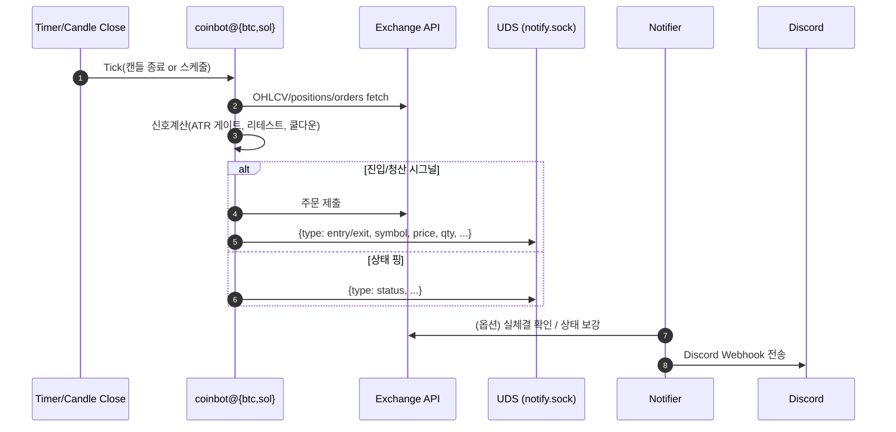

# Architecture Overview

> 개인 연구/포트폴리오용 자동매매(알고) 봇 아키텍처 개요입니다. (투자 권유 아님)
> 전략 소스는 비포함. 여기서는 **운영·리스크·실행/체크 루프** 관점으로 설명합니다.

**Quick Links**

* Runtime Params: `../ops/param-log.md`, `../runtime-params.md`
* Ops Runbook: `../ops/commands.md`
* Notifier: `./notifier.md`

---

## 1) System Context

```mermaid
flowchart LR
  subgraph EX[Exchange (Binance Futures)]
    MKT[(Market Data / Orders)]
  end

  subgraph S[Server (Ubuntu)]
    subgraph BOTS[coinbot instances]
      B1[coinbot@btc]\nTIMEFRAME=5m\nLEVERAGE=7
      B2[coinbot@sol]\nTIMEFRAME=3m\nLEVERAGE=3
    end
    ST[(State & Logs)\n/opt/coinbot/state\njournalctl]
    UDS[/run/coinbot/notify.sock/]
    NTFY[Notifier Service\ncoinbot-position-notifier]
  end

  EX <--> B1
  EX <--> B2
  B1 -- JSON events --> UDS
  B2 -- JSON events --> UDS
  UDS --> NTFY
  NTFY -- Webhook --> DC[(Discord)]
  B1 --> ST
  B2 --> ST
```

* **coinbot@{btc,sol}**: 종목별 인스턴스. 환경변수(`/etc/default/coinbot-<pair>`)로 파라미터 주입.
* **State & Logs**: PnL/사이클 집계용 상태 파일, 시스템 저널(journald).
* **Notifier**: UDS 메시지 수신 → 필터/보강 → Discord Webhook 전송. `ENTRY_NOTIFY_MODE=all`, `CONFIRM_EXCHANGE=1`, `STATUS_ENRICH=1` 옵션 지원.

---

## 2) Strategy Layer (개념)

> 전략 구현 자체는 비공개. 운영에 영향 주는 **파라미터 인터페이스**만 정리.

| 파라미터                    | 목적            | 효과/트레이드오프                            |
| ----------------------- | ------------- | ------------------------------------ |
| `TIMEFRAME`             | 캔들 주기         | 짧을수록 반응성↑/노이즈↑, 길수록 안정성↑/빈도↓         |
| `ATR_GATE_MULT`         | 변동성 기반 진입 게이트 | 높일수록 신호↓(과잉필터 위험), 낮출수록 신호↑(가짜신호 위험) |
| `ENTRY_RETEST_TOL_PCT`  | 리테스트 허용 오차(%) | 낮을수록 정밀도↑/기회↓                        |
| `ENTRY_RETEST_WINDOW_S` | 리테스트 허용 시간(s) | 길수록 재확인 유연성↑/지연·중복 위험                |
| `ENTRY_COOLDOWN_S`      | 재진입 쿨다운(s)    | 중복 진입 억제 / 지나치면 기회 손실                |
| `LEVERAGE`              | 레버리지 배수       | 포지션 크기/리스크 조절                        |

**운영 룰(요약)**

* 목표: `BTC ≥ 0.20 cycles/h`, `SOL ≥ 0.30 cycles/h`, `PF ≥ 1.3`
* 롤백: `PF < 1.2`이면 직전 ATR 변경을 즉시 되돌림.

---

## 3) Execution / Check Loop



* **Tick**: 캔들 종료 또는 내부 스케줄러에서 호출.
* **신호 필터**: `ATR_GATE_MULT` → `ENTRY_RETEST_*` → `ENTRY_COOLDOWN_S` 순으로 가드 적용.
* **체결 확인**: Notifier가 `CONFIRM_EXCHANGE=1`일 때 거래소 체결을 확인 후 전송.
* **관측가능성**: `bot-pnl`로 PnL/사이클, `checkup.sh`로 종합 점검.

---

## 4) Reliability & Recovery

* **systemd**: `Restart=always`, `RestartSec=5s`로 실패 자동 복구.
* **Idempotent I/O**: 동일 이벤트 중복 전송 방지(쿨다운/화이트리스트).
* **네트워크 오류**: Notifier는 지수백오프 재시도, `408/5xx` 빈도 모니터링.
* **Config Drift 방지**: `/proc/<pid>/environ` 검사로 런타임 파라미터 반영 확인.

---

## 5) Observability & Ops

* **지표**: `cycles/h`, `PF`, 실손익(USDT).
* **집계 도구**: `/usr/local/bin/bot-pnl` (개별/사이클 요약), `scripts/checkup.sh` (원터치 점검).
* **리포팅**: `ops/run-logs/YYYY-MM-DD.md` Run Report, `ops/param-log.md` 파라미터 변경 로그.

---

## 6) Security & Secrets

* `.env.example`만 리포에 포함. 실제 키는 `/etc/default/*`에만 저장.
* 최소 권한 원칙(전용 `coinbot` 사용자, `/run/coinbot` 소유).
* Discord Webhook은 리포에 노출 금지.

---

## 7) UDS Event Schema (요약)

```json
{
  "ts": "2025-09-06T09:15:30Z",
  "type": "entry|exit|status|warn|flip|liquidation",
  "symbol": "BTCUSDT|SOLUSDT",
  "side": "LONG|SHORT",
  "price": 123.45,
  "qty": 0.001,
  "orderId": "...",
  "extra": {"timeframe": "5m", "leverage": 7}
}
```

* 필수: `type`, `symbol`.
* 선택: `orderId`(체결 확인에 사용), `extra`(메타데이터).

---

## 8) 현재 스냅샷(참고)

* **BTC**: `TIMEFRAME=5m`, `LEVERAGE=7`, `ENTRY_RETEST_TOL_PCT=0.07`, `ENTRY_RETEST_WINDOW_S=90`, `ENTRY_COOLDOWN_S=360`, `ATR_GATE_MULT=1.25`
* **SOL**: `TIMEFRAME=3m`, `LEVERAGE=3`, `ENTRY_RETEST_TOL_PCT=0.08`, `ENTRY_RETEST_WINDOW_S=150`, `ENTRY_COOLDOWN_S=420`, `ATR_GATE_MULT=1.12`

> 상세 변화 이력은 `../ops/param-log.md` 참고.
